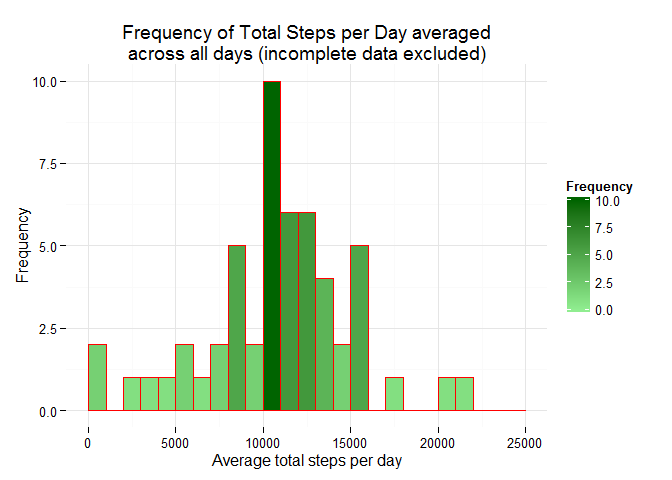
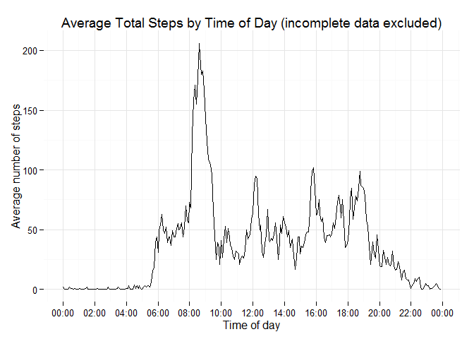
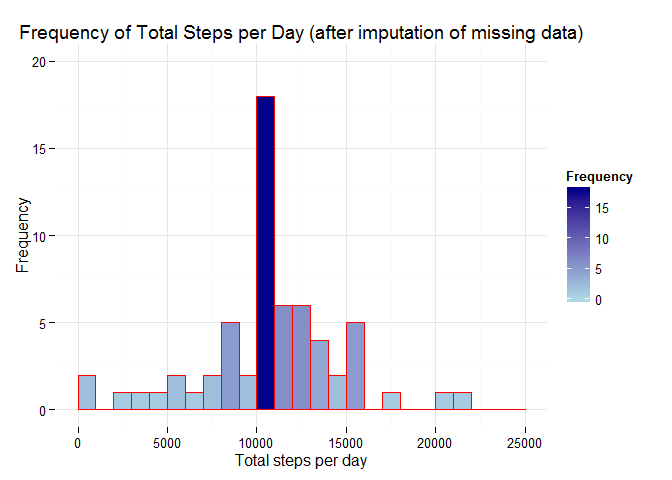
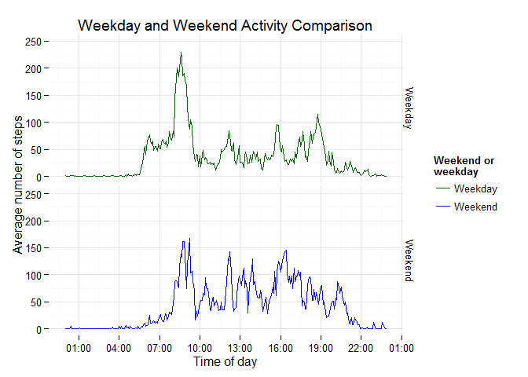

# Reproducible Research: Peer Assessment 1

## Loading and preprocessing the data

Show any code that is needed to

1. Load the data (i.e. read.csv())


```r
## Clear environment
rm(list = ls())

## If necessary, create receiving directory for data.
## if(!file.exists("data")) {dir.create("data")}

## Download and unzip data file.
## fileUrl <- "https://d396qusza40orc.cloudfront.net/repdata%2Fdata%2Factivity.zip"
## download.file(fileUrl, destfile = "./data/activity.zip", mode = 'wb')
## paste0("Date of download = ", Sys.time())

## Zipped data file is loaded into "./data" directory".
## Extract file.
unzip(zipfile = "./data/activity.zip", exdir = "./data")

## Read data
activity <- read.csv("./data/activity.csv", colClasses = c("numeric",
        "POSIXct", "numeric"))

## Load required libraries
library(lubridate)
library(dplyr)
library(ggplot2)
library(scales)
```


2. Process/transform the data into a format suitable for analysis

Note that any processing specific to a section is shown in that section -- for example, imputation of missing data is performed in the section entitled "Imputing missing values", etc. Only preliminary padding of the 'interval' field is shown here.


```r
## Pad the the interval field with sufficient leading zeroes
## to include 4 digits.
activity$interval <- sprintf("%04d", activity$interval)
```


## What is mean total number of steps taken per day?

Missing values in the dataset are explicitly *excluded* in this section.

### 1. Calculation of total number of steps taken per day
Note: this data is available in dataframe 'act_C_byDate'. Only the summary and the first few observations in the dataframe are explicitly displayed here.


```r
## Create new dataframe excluding NA values
act_C_byDate <- activity %>% filter(complete.cases(activity[])) %>%
        group_by(date) %>% summarize(steps = sum(steps))

summary(act_C_byDate)
```

```
##       date                         steps      
##  Min.   :2012-10-02 00:00:00   Min.   :   41  
##  1st Qu.:2012-10-16 00:00:00   1st Qu.: 8841  
##  Median :2012-10-29 00:00:00   Median :10765  
##  Mean   :2012-10-30 17:12:27   Mean   :10766  
##  3rd Qu.:2012-11-16 00:00:00   3rd Qu.:13294  
##  Max.   :2012-11-29 00:00:00   Max.   :21194
```

```r
act_C_byDate
```

```
## Source: local data frame [53 x 2]
## 
##          date steps
## 1  2012-10-02   126
## 2  2012-10-03 11352
## 3  2012-10-04 12116
## 4  2012-10-05 13294
## 5  2012-10-06 15420
## 6  2012-10-07 11015
## 7  2012-10-09 12811
## 8  2012-10-10  9900
## 9  2012-10-11 10304
## 10 2012-10-12 17382
## ..        ...   ...
```

### 2. Histogram of the total number of steps taken each day


```r
ggplot(data=act_C_byDate, aes(steps)) +
        scale_fill_gradient("Frequency", low = "lightgreen", high = "darkgreen") +
        geom_histogram(col="red", aes(fill = ..count..),
                       breaks=seq(0, 25000, by = 1000)) +
        theme_minimal() + xlab("Average total steps per day") + ylab("Frequency") +
        labs(title = "Frequency of Total Steps per Day averaged\nacross all days (incomplete data excluded)")
```

 


### 3. Mean and median of the total number of steps taken per day

This information is available in the summry shown in (1.) above, but is explicitly generated here for clarity.


```r
paste("Mean total steps per day = ", round(mean(act_C_byDate$steps)))
```

```
## [1] "Mean total steps per day =  10766"
```

```r
paste("Median total steps per day = ", median(act_C_byDate$steps))
```

```
## [1] "Median total steps per day =  10765"
```


## What is the average daily activity pattern?
### 1. Time series plot of the 5-minute interval (x-axis) and the average number of steps taken, averaged across all days (y-axis)

Note that the x-axis has been labelled by "Time of Day" rather than by "Interval" for the purpose of more intuitive comprehension.


```r
act_C_byItvl <- activity %>% filter(complete.cases(activity[])) %>%
        group_by(interval) %>% summarize(steps = round(mean(steps)))

hours <- substr(act_C_byItvl$interval, 1, 2)
minutes <- substr(act_C_byItvl$interval, 3, 4)
act_C_byItvl$interval <- paste0(hours, ":", minutes)
act_C_byItvl$interval <- as.POSIXct(act_C_byItvl$interval, format = "%H:%M", tz = "")

ggplot(act_C_byItvl, aes(x = interval, y = steps)) +
        geom_line() +
        theme_minimal() +
        xlab("Time of day") +
        ylab("Average number of steps") +
        #scale_x_continuous() +
        scale_x_datetime(breaks = date_breaks("2 hours"),
                         labels = date_format("%H:%M", tz = "")) +
        #geom_vline(xintercept = maxActivityInterval) +
        #scale_x_datetime(labels = date_format(format = "%H:%M", tz = "")) +
        labs(title = "Average Total Steps by Time of Day (incomplete data excluded)")
```

 


### 2. Determination of 5-minute interval, on average across all the days in the dataset, containing the maximum number of steps


```r
Itvl_Max_Activity <- act_C_byItvl$interval[which.max(act_C_byItvl$steps)]

paste0("The 5-minute interval displaying the most activity is ", format(Itvl_Max_Activity, format = "%R", tz = ""))
```

```
## [1] "The 5-minute interval displaying the most activity is 08:35"
```


## Imputing missing values

Note that there are a number of days/intervals where there are missing values (coded as NA). The presence of missing days may introduce bias into some calculations or summaries of the data.

### 1. Calculate and report the total number of missing values in the dataset (i.e. the total number of rows with NAs)


```r
## Determine the total number of missing values in the dataset
incompleteObservations <- sum(!complete.cases(activity[]))
```

The dataset contains 2304 incomplete observations.

### 2. Strategy for filling in all of the missing values in the dataset.

The approach adopted is to populate any NA 'steps' entries for each interval with the mean of the remainder of the entries for the same interval, excluding NA values. The code that performs this is shown in the next section.

### 3. Create a new dataset that is equal to the original dataset but with the missing data filled in.


```r
## Create a new dataset that is equal to the original dataset but with
## the missing data filled in.
act_F <- activity %>% group_by(interval) %>% mutate(steps = ifelse(is.na(steps),
             round(mean(steps, na.rm = TRUE)), steps)) %>% ungroup()
```


### 4(a). Histogram of the total number of steps taken each day


```r
act_F_byDate <-  act_F %>% group_by(date) %>% summarize(steps = sum(steps))
ggplot(data=act_F_byDate, aes(steps)) +
        scale_fill_gradient("Frequency", low = "lightblue", high = "darkblue") +
        ylim(0, 20) +
        geom_histogram(col="red", aes(fill = ..count..),
                       breaks=seq(0, 25000, by = 1000)) +
        theme_minimal() + xlab("Total steps per day") + ylab("Frequency") +
        labs(title = "Frequency of Total Steps per Day (after imputation of missing data)")
```

 

### 4(b). Calculation of mean and median total number of steps taken per day


```r
## Calculate mean and median of total steps per day with dataset containg imputed data
paste("Mean total steps per day = ", round(mean(act_F_byDate$steps)))
```

```
## [1] "Mean total steps per day =  10766"
```

```r
paste("Median total steps per day = ", median(act_F_byDate$steps))
```

```
## [1] "Median total steps per day =  10762"
```

It is evident from comparison of the plot (including imputed data) with the earlier histogram (excluding incomplete observations) that most if not all of the incomplete observations are in the 10000 - 11000 bin. Neither the mean nor the median has materially changed, and distribution of counts remains broadly unchanged.

| Dataset        | Mean     | Median  |
| :------------- |:-------: | :------:|
| NAs removed    | 10766    |  10765  |
| Values imputed | 10766    |  10762  |


## Are there differences in activity patterns between weekdays and weekends?

This section utilizes the dataset with the filled-in missing values.

### 1. Create a new factor variable in the dataset with two levels - "weekday" and "weekend" indicating whether a given date is a weekday or weekend day.


```r
act_F_byDayType <- act_F %>% mutate(dayType = as.factor(ifelse(weekdays(date)
                %in% c("Saturday", "Sunday"), "Weekend", "Weekday"))) %>%
        group_by(dayType, interval) %>%
        summarize(steps = round(mean(steps)))
```

### 2. Panel plot containing a time series plot of the 5-minute interval (x-axis) and the average number of steps taken, averaged across all weekday days or weekend days (y-axis).


```r
hours <- substr(act_F_byDayType$interval, 1, 2)
minutes <- substr(act_F_byDayType$interval, 3, 4)
act_F_byDayType$interval <- paste0(hours, ":", minutes)
act_F_byDayType$interval <- as.POSIXct(act_C_byItvl$interval, format = "%H:%M", tz = "")

ggplot(act_F_byDayType, aes(x = interval,
               y = steps,
               group = dayType,
               color = dayType)) +
        scale_colour_manual(values=c("darkgreen", "blue"),
                name = "Weekend or\nweekday") +
        scale_x_datetime(breaks = date_breaks("3 hours"),
                         labels = date_format("%H:%M", tz = "")) +
        # scale_y_discrete(breaks = 0:100) +
        theme_minimal() +
        geom_line() +
        facet_grid(dayType ~ .) +
        ylim(0, 250) +
        ggtitle("Weekday and Weekend Activity Comparison") +
        xlab("Time of day") +
        ylab("Average number of steps")
```

 


